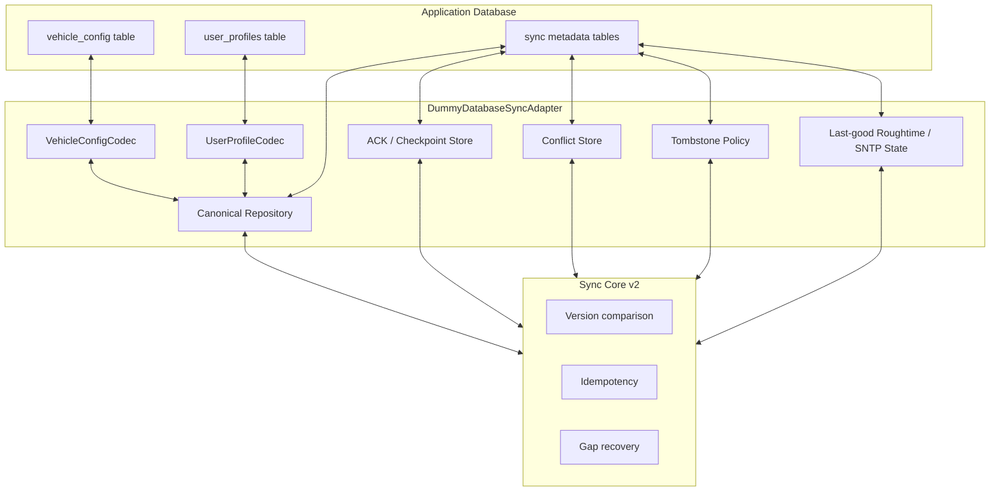
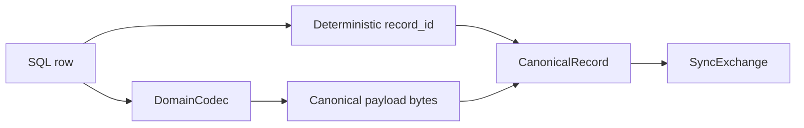
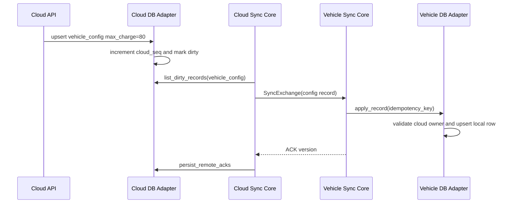
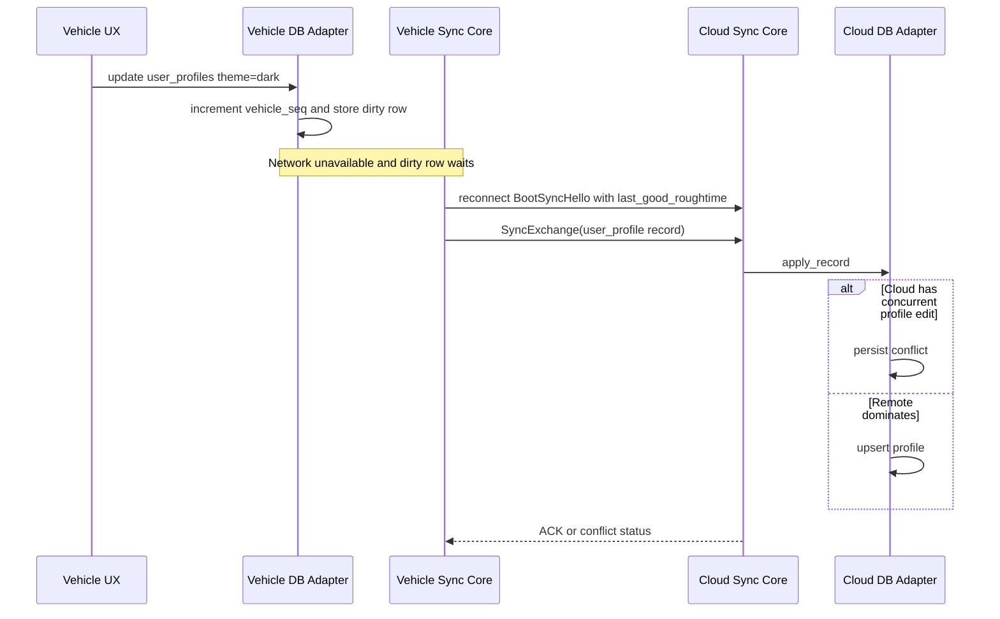

# Cloud-Vehicle Database Sync Adapter Example v2

**Version:** 2.0  
**Date:** 2026-06-08  
**Status:** DRAFT example  
**Scope:** Rust-like illustrative pseudocode; not intended to compile as-is.

## 1. Purpose

This document shows a dummy database-sync adapter for arbitrary database tables using the v2 adapter contract. The example focuses on two practical namespaces:

- `vehicle_config`: cloud-owned desired configuration values.
- `user_profiles`: shared user profile data that may be changed from cloud apps or vehicle UX.

The pseudocode demonstrates how a database adapter maps rows to canonical records, enumerates dirty rows, applies inbound records idempotently, persists ACKs/checkpoints/conflicts, computes deterministic checksums, handles tombstones, and stores last-good Roughtime plus SNTP status.

## 2. Example Architecture



## 3. Dummy SQL Schema

A real implementation may use a different schema. The important part is that the logical fields are durable and queryable.

```sql
-- Domain table: cloud-owned desired configuration.
CREATE TABLE vehicle_config (
  vehicle_id TEXT NOT NULL,
  config_key TEXT NOT NULL,
  value_json TEXT NOT NULL,
  schema_version INTEGER NOT NULL,
  cloud_seq INTEGER NOT NULL DEFAULT 0,
  vehicle_seq INTEGER NOT NULL DEFAULT 0,
  deleted INTEGER NOT NULL DEFAULT 0,
  updated_by_node TEXT NOT NULL,
  PRIMARY KEY (vehicle_id, config_key)
);

-- Domain table: shared user profile data.
CREATE TABLE user_profiles (
  profile_id TEXT PRIMARY KEY,
  display_name TEXT NOT NULL,
  preferences_json TEXT NOT NULL,
  schema_version INTEGER NOT NULL,
  cloud_seq INTEGER NOT NULL DEFAULT 0,
  vehicle_seq INTEGER NOT NULL DEFAULT 0,
  origin_node_id TEXT NOT NULL,
  deleted INTEGER NOT NULL DEFAULT 0
);

-- Canonical metadata shared by all namespaces.
CREATE TABLE sync_records (
  namespace_name TEXT NOT NULL,
  origin_node_id TEXT NOT NULL,
  record_id BLOB NOT NULL,
  cloud_seq INTEGER NOT NULL,
  vehicle_seq INTEGER NOT NULL,
  operation TEXT NOT NULL,
  payload BLOB NOT NULL,
  schema_version INTEGER NOT NULL,
  payload_checksum INTEGER NOT NULL,
  idempotency_key TEXT,
  tombstone_reason TEXT,
  PRIMARY KEY (namespace_name, origin_node_id, record_id)
);

CREATE TABLE sync_idempotency_ledger (
  idempotency_key TEXT PRIMARY KEY,
  namespace_name TEXT NOT NULL,
  origin_node_id TEXT NOT NULL,
  record_id BLOB NOT NULL,
  cloud_seq INTEGER NOT NULL,
  vehicle_seq INTEGER NOT NULL,
  outcome TEXT NOT NULL
);

CREATE TABLE sync_remote_acks (
  local_node_id TEXT NOT NULL,
  remote_node_id TEXT NOT NULL,
  namespace_name TEXT NOT NULL,
  origin_node_id TEXT NOT NULL,
  record_id BLOB NOT NULL,
  cloud_seq INTEGER NOT NULL,
  vehicle_seq INTEGER NOT NULL,
  PRIMARY KEY (local_node_id, remote_node_id, namespace_name, origin_node_id, record_id)
);

CREATE TABLE sync_checkpoints (
  local_node_id TEXT NOT NULL,
  remote_node_id TEXT NOT NULL,
  namespace_name TEXT NOT NULL,
  sequence_number INTEGER NOT NULL,
  last_record_id BLOB NOT NULL,
  last_origin_node_id TEXT NOT NULL,
  last_cloud_seq INTEGER NOT NULL,
  last_vehicle_seq INTEGER NOT NULL,
  PRIMARY KEY (local_node_id, remote_node_id, namespace_name)
);

CREATE TABLE sync_conflicts (
  conflict_id TEXT PRIMARY KEY,
  namespace_name TEXT NOT NULL,
  origin_node_id TEXT NOT NULL,
  record_id BLOB NOT NULL,
  local_payload BLOB NOT NULL,
  remote_payload BLOB NOT NULL,
  local_cloud_seq INTEGER NOT NULL,
  local_vehicle_seq INTEGER NOT NULL,
  remote_cloud_seq INTEGER NOT NULL,
  remote_vehicle_seq INTEGER NOT NULL,
  conflict_class TEXT NOT NULL,
  resolved INTEGER NOT NULL DEFAULT 0
);

CREATE TABLE sync_time_state (
  provider_id TEXT PRIMARY KEY,
  last_good_evidence BLOB,
  last_good_evidence_id TEXT,
  last_good_midpoint_unix_ms INTEGER,
  last_good_radius_ms INTEGER,
  clock_sync_status_json TEXT
);
```

## 4. Domain Row Mapping



### 4.1 Vehicle Configuration Codec

```rust
struct VehicleConfigCodec;

impl DomainCodec for VehicleConfigCodec {
    fn namespace(&self) -> &str { "vehicle_config" }
    fn schema_version(&self) -> u32 { 1 }

    fn record_id_for_row(&self, row: &DomainRow) -> Result<Vec<u8>> {
        // Stable and deterministic: vehicle_id + config_key.
        Ok(format!("{}:{}", row["vehicle_id"], row["config_key"]).into_bytes())
    }

    fn owner_for_record(&self, _locator: &RecordLocator) -> RecordOwner {
        RecordOwner::Cloud
    }

    async fn encode_row(&self, row: DomainRow) -> Result<CanonicalRecord> {
        let payload = json_bytes({
            "vehicle_id": row["vehicle_id"],
            "config_key": row["config_key"],
            "value_json": row["value_json"]
        });

        Ok(CanonicalRecord {
            locator: RecordLocator {
                record_id: self.record_id_for_row(&row)?,
                namespace_name: "vehicle_config".to_string(),
                origin_node_id: "cloud".to_string(),
            },
            version_vector: VersionVector {
                cloud_seq: row.u64("cloud_seq"),
                vehicle_seq: row.u64("vehicle_seq"),
            },
            operation: if row.bool("deleted") { RecordOperation::Delete } else { RecordOperation::Update },
            payload_checksum: fnv1a64(&payload),
            payload,
            schema_version: self.schema_version(),
            idempotency_key: deterministic_idempotency_key(...),
            correlation_id: new_correlation_id(),
            observed_time: None,
            created_time_hint: None,
            updated_time_hint: None,
            tombstone_time_hint: None,
            tombstone_reason: None,
        })
    }

    async fn decode_record(&self, record: &CanonicalRecord) -> Result<DomainMutation> {
        let doc = parse_json(&record.payload)?;
        if record.operation == RecordOperation::Delete {
            return Ok(DomainMutation::SoftDelete {
                table: "vehicle_config",
                key: record.locator.record_id.clone(),
                cloud_seq: record.version_vector.cloud_seq,
                vehicle_seq: record.version_vector.vehicle_seq,
            });
        }

        Ok(DomainMutation::Upsert {
            table: "vehicle_config",
            key_values: map! {
                "vehicle_id" => doc["vehicle_id"],
                "config_key" => doc["config_key"],
                "value_json" => doc["value_json"],
                "schema_version" => record.schema_version,
                "cloud_seq" => record.version_vector.cloud_seq,
                "vehicle_seq" => record.version_vector.vehicle_seq,
                "updated_by_node" => record.locator.origin_node_id.clone(),
            },
        })
    }
}
```

### 4.2 User Profile Codec

```rust
struct UserProfileCodec;

impl DomainCodec for UserProfileCodec {
    fn namespace(&self) -> &str { "user_profiles" }
    fn schema_version(&self) -> u32 { 1 }

    fn record_id_for_row(&self, row: &DomainRow) -> Result<Vec<u8>> {
        Ok(row["profile_id"].as_bytes().to_vec())
    }

    fn owner_for_record(&self, _locator: &RecordLocator) -> RecordOwner {
        // Both cloud app and vehicle UX may edit profiles.
        RecordOwner::Shared
    }

    async fn encode_row(&self, row: DomainRow) -> Result<CanonicalRecord> {
        let payload = json_bytes({
            "profile_id": row["profile_id"],
            "display_name": row["display_name"],
            "preferences_json": row["preferences_json"]
        });

        Ok(CanonicalRecord {
            locator: RecordLocator {
                record_id: self.record_id_for_row(&row)?,
                namespace_name: "user_profiles".to_string(),
                origin_node_id: row.string("origin_node_id"),
            },
            version_vector: VersionVector {
                cloud_seq: row.u64("cloud_seq"),
                vehicle_seq: row.u64("vehicle_seq"),
            },
            operation: if row.bool("deleted") { RecordOperation::Delete } else { RecordOperation::Update },
            payload_checksum: fnv1a64(&payload),
            payload,
            schema_version: self.schema_version(),
            idempotency_key: deterministic_idempotency_key(...),
            correlation_id: new_correlation_id(),
            observed_time: None,
            created_time_hint: None,
            updated_time_hint: None,
            tombstone_time_hint: None,
            tombstone_reason: None,
        })
    }

    async fn decode_record(&self, record: &CanonicalRecord) -> Result<DomainMutation> {
        let doc = parse_json(&record.payload)?;
        Ok(DomainMutation::Upsert {
            table: "user_profiles",
            key_values: map! {
                "profile_id" => doc["profile_id"],
                "display_name" => doc["display_name"],
                "preferences_json" => doc["preferences_json"],
                "schema_version" => record.schema_version,
                "cloud_seq" => record.version_vector.cloud_seq,
                "vehicle_seq" => record.version_vector.vehicle_seq,
                "origin_node_id" => record.locator.origin_node_id.clone(),
                "deleted" => record.operation == RecordOperation::Delete,
            },
        })
    }
}
```

## 5. Dummy Adapter Pseudocode

```rust
struct DummyDatabaseSyncAdapter {
    db: SqlConnectionPool,
    codecs: HashMap<String, Arc<dyn DomainCodec>>,
}

impl DummyDatabaseSyncAdapter {
    async fn codec(&self, namespace: &str) -> Result<Arc<dyn DomainCodec>> {
        self.codecs
            .get(namespace)
            .cloned()
            .ok_or_else(|| Error::UnknownNamespace(namespace.to_string()))
    }

    async fn load_local_record(&self, locator: &RecordLocator) -> Result<Option<CanonicalRecord>> {
        self.db.query_optional("""
            SELECT * FROM sync_records
             WHERE namespace_name = ? AND origin_node_id = ? AND record_id = ?
        """, [locator.namespace_name, locator.origin_node_id, locator.record_id]).await
    }
}
```

### 5.1 Idempotent Apply

```rust
#[async_trait]
impl CanonicalRecordRepository for DummyDatabaseSyncAdapter {
    async fn apply_record(
        &self,
        record: CanonicalRecord,
        idempotency_key: &str,
        sender_node_id: &str,
    ) -> Result<ApplyResult> {
        let tx = self.db.begin().await?;

        if let Some(entry) = tx.find_idempotency(idempotency_key).await? {
            tx.commit().await?;
            return Ok(ApplyResult::duplicate(entry.durable_version));
        }

        let local = self.load_local_record(&record.locator).await?;
        let owner = self.codec(&record.locator.namespace_name).await?
            .owner_for_record(&record.locator);

        let decision = SyncCore::resolve_remote_record(
            &record,
            local.as_ref(),
            owner,
            sender_node_id,
        );

        match decision.disposition {
            ApplyDisposition::Applied => {
                let mutation = self.codec(&record.locator.namespace_name).await?
                    .decode_record(&record).await?;
                tx.apply_domain_mutation(mutation).await?;
                tx.upsert_canonical_record(&record, idempotency_key).await?;
            }
            ApplyDisposition::ConflictPersisted
            | ApplyDisposition::NonOwnerRejected
            | ApplyDisposition::StaleRejected => {
                if let Some(conflict) = decision.conflict_record {
                    tx.insert_conflict(conflict).await?;
                }
            }
            ApplyDisposition::Duplicate => {}
        }

        tx.insert_idempotency(idempotency_key, &record, decision.disposition).await?;
        tx.commit().await?;
        Ok(ApplyResult::from_decision(decision, record.version_vector))
    }

    async fn get_record(&self, locator: &RecordLocator) -> Result<Option<CanonicalRecord>> {
        self.load_local_record(locator).await
    }
```

### 5.2 Dirty Enumeration

```rust
    async fn list_dirty_records(&self, query: DirtyRecordQuery) -> Result<Vec<CanonicalRecord>> {
        self.db.query("""
            SELECT r.*
              FROM sync_records r
         LEFT JOIN sync_remote_acks a
                ON a.local_node_id = ?
               AND a.remote_node_id = ?
               AND a.namespace_name = r.namespace_name
               AND a.origin_node_id = r.origin_node_id
               AND a.record_id = r.record_id
             WHERE r.namespace_name = ?
               AND (? OR r.operation != 'DELETE')
               AND (
                   a.record_id IS NULL
                   OR a.cloud_seq != r.cloud_seq
                   OR a.vehicle_seq != r.vehicle_seq
               )
          ORDER BY r.namespace_name, r.origin_node_id, r.record_id
             LIMIT ?
        """, [
            query.session.local_node_id,
            query.session.remote_node_id,
            query.session.namespace_name,
            query.include_tombstones,
            query.limit.or_unlimited(),
        ]).await
    }
```

### 5.3 Deterministic Checksum and ID Listing

```rust
    async fn compute_state_checksum(&self, scope: StateScope) -> Result<u64> {
        let rows = self.db.query("""
            SELECT namespace_name, origin_node_id, record_id,
                   cloud_seq, vehicle_seq, operation, payload, schema_version,
                   tombstone_reason
              FROM sync_records
             WHERE namespace_name = ?
               AND (? OR operation != 'DELETE')
          ORDER BY namespace_name, origin_node_id, record_id
        """, [scope.namespace_name, scope.include_tombstones]).await?;

        let mut hash = Fnv1a64::new();
        for row in rows {
            hash.mix(row.namespace_name);
            hash.mix(row.origin_node_id);
            hash.mix(row.record_id);
            hash.mix(row.cloud_seq);
            hash.mix(row.vehicle_seq);
            hash.mix(row.operation);
            hash.mix(row.payload);
            hash.mix(row.schema_version);
            hash.mix(row.tombstone_reason);
        }
        Ok(hash.finish())
    }

    async fn list_record_ids(&self, query: RecordIdQuery) -> Result<Vec<RecordLocator>> {
        self.db.query("""
            SELECT namespace_name, origin_node_id, record_id
              FROM sync_records
             WHERE namespace_name = ?
               AND (? OR operation != 'DELETE')
          ORDER BY namespace_name, origin_node_id, record_id
             LIMIT ?
        """, [query.namespace_name, query.include_tombstones, query.limit.or_unlimited()]).await
    }
}
```

Checksum intentionally excludes Roughtime evidence, SNTP status, idempotency keys, correlation IDs, checkpoints, and conflicts.

## 6. ACK and Checkpoint Persistence

```rust
#[async_trait]
impl SyncSessionStore for DummyDatabaseSyncAdapter {
    async fn persist_remote_acks(&self, session: &SyncSessionKey, acks: Vec<VersionAck>) -> Result<()> {
        let tx = self.db.begin().await?;
        for ack in acks {
            tx.execute("""
                INSERT INTO sync_remote_acks (..., cloud_seq, vehicle_seq)
                VALUES (...)
                ON CONFLICT (...) DO UPDATE SET
                    cloud_seq = max(sync_remote_acks.cloud_seq, excluded.cloud_seq),
                    vehicle_seq = max(sync_remote_acks.vehicle_seq, excluded.vehicle_seq)
            """).await?;
        }
        tx.commit().await
    }

    async fn list_remote_acks(&self, session: &SyncSessionKey) -> Result<Vec<VersionAck>> {
        self.db.query("""
            SELECT * FROM sync_remote_acks
             WHERE local_node_id = ? AND remote_node_id = ? AND namespace_name = ?
          ORDER BY namespace_name, origin_node_id, record_id
        """, [session.local_node_id, session.remote_node_id, session.namespace_name]).await
    }

    async fn read_checkpoint(&self, session: &SyncSessionKey) -> Result<Option<CheckpointToken>> {
        self.db.query_optional("""
            SELECT * FROM sync_checkpoints
             WHERE local_node_id = ? AND remote_node_id = ? AND namespace_name = ?
        """, [session.local_node_id, session.remote_node_id, session.namespace_name]).await
    }

    async fn write_checkpoint(&self, session: &SyncSessionKey, checkpoint: CheckpointToken) -> Result<()> {
        self.db.execute("""
            INSERT INTO sync_checkpoints (..., sequence_number, ...)
            VALUES (...)
            ON CONFLICT (...) DO UPDATE SET
                sequence_number = CASE
                    WHEN excluded.sequence_number > sync_checkpoints.sequence_number
                    THEN excluded.sequence_number
                    ELSE sync_checkpoints.sequence_number
                END,
                ...
        """).await
    }
}
```

## 7. Conflict and Tombstone Handling

```rust
#[async_trait]
impl ConflictStore for DummyDatabaseSyncAdapter {
    async fn persist_conflict(&self, conflict: ConflictRecord) -> Result<()> {
        self.db.execute("""
            INSERT INTO sync_conflicts (
                conflict_id, namespace_name, origin_node_id, record_id,
                local_payload, remote_payload,
                local_cloud_seq, local_vehicle_seq,
                remote_cloud_seq, remote_vehicle_seq,
                conflict_class, resolved
            ) VALUES (?, ?, ?, ?, ?, ?, ?, ?, ?, ?, ?, 0)
        """).await
    }

    async fn query_conflicts(&self, query: ConflictQuery) -> Result<Vec<ConflictRecord>> {
        self.db.query("""
            SELECT * FROM sync_conflicts
             WHERE namespace_name = ?
               AND (? OR resolved = 0)
          ORDER BY namespace_name, origin_node_id, record_id, conflict_id
             LIMIT ?
        """, [query.namespace_name, query.include_resolved, query.limit]).await
    }
}

#[async_trait]
impl TombstoneStore for DummyDatabaseSyncAdapter {
    async fn list_tombstones_for_gc(&self, query: TombstoneGcQuery) -> Result<Vec<CanonicalRecord>> {
        self.db.query("""
            SELECT r.*
              FROM sync_records r
              JOIN sync_remote_acks a ON a.namespace_name = r.namespace_name
                                     AND a.origin_node_id = r.origin_node_id
                                     AND a.record_id = r.record_id
                                     AND a.cloud_seq = r.cloud_seq
                                     AND a.vehicle_seq = r.vehicle_seq
             WHERE r.namespace_name = ?
               AND r.operation = 'DELETE'
               AND r.tombstone_time_hint <= ?
          ORDER BY r.namespace_name, r.origin_node_id, r.record_id
             LIMIT ?
        """, [query.session.namespace_name, query.retention_cutoff, query.limit]).await
    }
}
```

## 8. Time State Storage

The adapter stores time state separately from logical records.

```rust
#[async_trait]
impl TimeStateStore for DummyDatabaseSyncAdapter {
    async fn write_last_good_time(&self, evidence: TimeEvidence) -> Result<()> {
        // For initial v2, provider_id is normally "roughtime".
        // A future signed time provider can use another provider_id.
        self.db.execute("""
            INSERT INTO sync_time_state (
                provider_id,
                last_good_evidence,
                last_good_evidence_id,
                last_good_midpoint_unix_ms,
                last_good_radius_ms
            ) VALUES (?, ?, ?, ?, ?)
            ON CONFLICT(provider_id) DO UPDATE SET
                last_good_evidence = excluded.last_good_evidence,
                last_good_evidence_id = excluded.last_good_evidence_id,
                last_good_midpoint_unix_ms = excluded.last_good_midpoint_unix_ms,
                last_good_radius_ms = excluded.last_good_radius_ms
        """, [
            evidence.provider_id,
            evidence.signed_evidence,
            evidence.evidence_id,
            evidence.midpoint_unix_ms,
            evidence.radius_ms,
        ]).await
    }

    async fn read_last_good_time(&self, provider_id: &str) -> Result<Option<TimeEvidence>> {
        self.db.query_optional("""
            SELECT * FROM sync_time_state WHERE provider_id = ?
        """, [provider_id]).await
    }

    async fn write_clock_sync_status(&self, status: ClockSyncStatus) -> Result<()> {
        // For initial v2, provider_id is normally "sntp".
        self.db.execute("""
            INSERT INTO sync_time_state (provider_id, clock_sync_status_json)
            VALUES (?, ?)
            ON CONFLICT(provider_id) DO UPDATE SET
                clock_sync_status_json = excluded.clock_sync_status_json
        """, [status.provider_id, to_json(status)]).await
    }

    async fn read_clock_sync_status(&self, provider_id: &str) -> Result<Option<ClockSyncStatus>> {
        self.db.query_optional("""
            SELECT clock_sync_status_json FROM sync_time_state WHERE provider_id = ?
        """, [provider_id]).await
    }
}
```

Roughtime and SNTP are not part of checksum input. They are used for boot confidence, audit, retention windows, and operations.

## 9. Example Flows

### 9.1 Cloud Updates Vehicle Configuration



### 9.2 Vehicle Edits User Profile While Offline



## 10. Minimal Contract Tests for This Adapter

Future Rust tests should verify:

```rust
#[tokio::test]
async fn dirty_config_rows_are_sent_until_acked() { /* ... */ }

#[tokio::test]
async fn user_profile_concurrent_edits_persist_conflict() { /* ... */ }

#[tokio::test]
async fn idempotency_survives_restart() { /* ... */ }

#[tokio::test]
async fn checksum_ignores_roughtime_and_sntp_state() { /* ... */ }

#[tokio::test]
async fn last_good_roughtime_is_restored_after_reboot() { /* ... */ }

#[tokio::test]
async fn sntp_status_can_be_replaced_by_other_clock_provider() { /* ... */ }
```

## 11. Summary

The dummy adapter shows the intended v2 implementation style:

- domain codecs map arbitrary tables to canonical records,
- storage traits persist logical sync state,
- time state is provider-neutral and independent of checksums,
- Roughtime is used as initial signed time evidence,
- SNTP is used after rough time and active connectivity for normal clock synchronization,
- all interfaces are Rust traits so underlying technologies can change independently.
