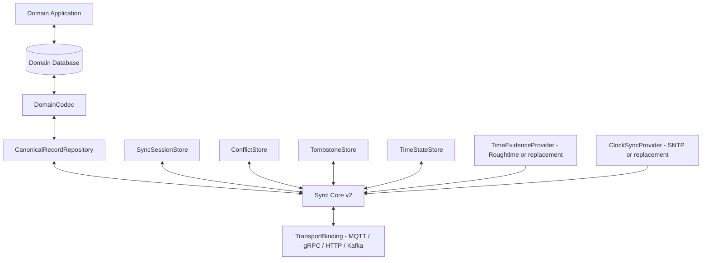

# Cloud-Vehicle Database Adapter Specification v2

**Version:** 2.0  
**Date:** 2026-06-08  
**Status:** DRAFT  
**Scope:** Replacement adapter/interface contract for future Rust implementation.

## 1. Purpose

This specification defines the v2 replacement for the v1 `CloudVehicleDbAdapter` interface. v2 is intentionally Rust-oriented and split into cohesive traits so the sync bridge can support different use cases and technologies without rewriting protocol logic.

The adapter layer MUST make the following technologies replaceable:

- database engine: SQLite, PostgreSQL, embedded KV store, event log, or future storage
- transport binding: MQTT, gRPC, HTTP, Kafka, store-and-forward, or future link
- time evidence provider: Roughtime initially, future signed time sources later
- clock synchronization provider: SNTP initially after rough time and active connectivity, PTP or future mechanisms later
- payload codec: JSON, protobuf, CBOR, domain-specific binary formats

The sync core MUST depend on stable traits and canonical value types, not concrete technology choices.

## 2. Design Principles

| Principle | Requirement |
| --- | --- |
| Small cohesive interfaces | Implementers can replace one concern without implementing unrelated concerns. |
| Logical correctness first | Version vectors, idempotency, checkpoints, and conflicts drive sync correctness. |
| Time-provider neutrality | Roughtime and SNTP are provider implementations behind traits; SNTP starts only after rough time and active connectivity. |
| Storage neutrality | SQL, embedded stores, CDC logs, and custom stores can implement the same persistence contract. |
| Transport neutrality | Adapter state does not depend on topics, brokers, partitions, sockets, or RPC framework. |
| Deterministic queries | Dirty records, IDs, and checksums are stable and testable. |
| Domain extension | New namespaces can be added with codecs/mappings rather than protocol changes. |

## 3. Interface Boundary Diagram



## 4. Canonical Types

The following Rust-like types are semantic contracts. Exact implementation may use structs, enums, async traits, and crate-specific error types.

```rust
pub struct RecordLocator {
    pub record_id: Vec<u8>,
    pub namespace_name: String,
    pub origin_node_id: String,
}

pub struct VersionVector {
    pub cloud_seq: u64,
    pub vehicle_seq: u64,
}

pub enum RecordOperation {
    Create,
    Update,
    Delete,
}

pub struct CanonicalRecord {
    pub locator: RecordLocator,
    pub version_vector: VersionVector,
    pub operation: RecordOperation,
    pub payload: Vec<u8>,
    pub schema_version: u32,
    pub payload_checksum: u64,
    pub idempotency_key: String,
    pub correlation_id: String,
    pub observed_time: Option<TimeObservation>,
    pub created_time_hint: Option<TimeObservation>,
    pub updated_time_hint: Option<TimeObservation>,
    pub tombstone_time_hint: Option<TimeObservation>,
    pub tombstone_reason: Option<String>,
}

pub struct SyncSessionKey {
    pub local_node_id: String,
    pub remote_node_id: String,
    pub namespace_name: String,
}

pub struct CheckpointToken {
    pub sequence_number: u64,
    pub last_record: RecordLocator,
    pub last_version: VersionVector,
}
```

Time abstractions:

```rust
pub struct TimeEvidence {
    pub provider_id: String,
    pub boot_id: String,
    pub evidence_id: String,
    pub midpoint_unix_ms: u64,
    pub radius_ms: u32,
    pub signed_evidence: Vec<u8>,
    pub public_key_id: String,
    pub verified: bool,
    pub received_monotonic_ms: u64,
}

pub enum TimeConfidenceKind {
    Verified,
    LastKnownGood,
    Unverified,
    Unavailable,
}

pub struct TimeConfidence {
    pub provider_id: String,
    pub earliest_unix_ms: u64,
    pub latest_unix_ms: u64,
    pub confidence: TimeConfidenceKind,
    pub source_evidence_id: String,
}

pub struct ClockSyncStatus {
    pub provider_id: String,
    pub synchronized: bool,
    pub offset_ms: i64,
    pub quality: String,
    pub last_sync_unix_ms: u64,
    pub seeded_by_evidence_id: String,
}
```

## 5. Replacement Rust Traits

### 5.1 DomainCodec

Maps domain rows to canonical records and back. This is what makes arbitrary database table sync possible.

```rust
#[async_trait]
pub trait DomainCodec: Send + Sync {
    fn namespace(&self) -> &str;
    fn schema_version(&self) -> u32;

    async fn encode_row(&self, row: DomainRow) -> Result<CanonicalRecord>;
    async fn decode_record(&self, record: &CanonicalRecord) -> Result<DomainMutation>;

    fn record_id_for_row(&self, row: &DomainRow) -> Result<Vec<u8>>;
    fn owner_for_record(&self, locator: &RecordLocator) -> RecordOwner;
}
```

### 5.2 CanonicalRecordRepository

Owns durable canonical record state and dirty enumeration.

```rust
#[async_trait]
pub trait CanonicalRecordRepository: Send + Sync {
    async fn get_record(&self, locator: &RecordLocator) -> Result<Option<CanonicalRecord>>;

    async fn apply_record(
        &self,
        record: CanonicalRecord,
        idempotency_key: &str,
        sender_node_id: &str,
    ) -> Result<ApplyResult>;

    async fn list_dirty_records(&self, query: DirtyRecordQuery) -> Result<Vec<CanonicalRecord>>;
    async fn list_record_ids(&self, query: RecordIdQuery) -> Result<Vec<RecordLocator>>;
    async fn compute_state_checksum(&self, scope: StateScope) -> Result<u64>;
}
```

Required behavior:

- Apply MUST be idempotent by `idempotency_key` across restarts.
- Dirty enumeration MUST use per-session ACK state, not wall-clock timestamps.
- Checksums MUST include logical record state only and exclude time evidence, SNTP status, idempotency ledger, and transport metadata.
- Deterministic ordering MUST be used for dirty records and ID lists.

### 5.3 SyncSessionStore

Separates durable ACKs from checkpoints.

```rust
#[async_trait]
pub trait SyncSessionStore: Send + Sync {
    async fn read_checkpoint(&self, session: &SyncSessionKey) -> Result<Option<CheckpointToken>>;
    async fn write_checkpoint(&self, session: &SyncSessionKey, checkpoint: CheckpointToken) -> Result<()>;

    async fn persist_remote_acks(&self, session: &SyncSessionKey, acks: Vec<VersionAck>) -> Result<()>;
    async fn list_remote_acks(&self, session: &SyncSessionKey) -> Result<Vec<VersionAck>>;
}
```

Rules:

- Checkpoints MUST NOT move backward.
- ACK storage MUST be durable and queryable after restart.
- Writing a checkpoint MUST NOT implicitly persist ACKs.
- Persisting ACKs MUST NOT implicitly advance checkpoints.

### 5.4 ConflictStore

```rust
#[async_trait]
pub trait ConflictStore: Send + Sync {
    async fn persist_conflict(&self, conflict: ConflictRecord) -> Result<()>;
    async fn query_conflicts(&self, query: ConflictQuery) -> Result<Vec<ConflictRecord>>;
    async fn mark_conflict_resolved(&self, conflict_id: ConflictId, resolution: ConflictResolution) -> Result<()>;
}
```

Conflicts MUST include local version, remote version, local payload, remote payload, conflict class, detected time confidence when available, and correlation ID.

### 5.5 TombstoneStore

```rust
#[async_trait]
pub trait TombstoneStore: Send + Sync {
    async fn list_tombstones_for_gc(&self, query: TombstoneGcQuery) -> Result<Vec<CanonicalRecord>>;
    async fn purge_tombstones(&self, tombstones: Vec<RecordLocator>, policy_id: &str) -> Result<PurgeResult>;
}
```

A tombstone is GC-eligible only when:

1. retention policy is satisfied using verified or last-known-good time confidence,
2. every relevant remote session has ACKed the tombstone version,
3. no active gap recovery depends on it.

### 5.6 TimeStateStore

Persists time provider state independently from records.

```rust
#[async_trait]
pub trait TimeStateStore: Send + Sync {
    async fn read_last_good_time(&self, provider_id: &str) -> Result<Option<TimeEvidence>>;
    async fn write_last_good_time(&self, evidence: TimeEvidence) -> Result<()>;
    async fn read_clock_sync_status(&self, provider_id: &str) -> Result<Option<ClockSyncStatus>>;
    async fn write_clock_sync_status(&self, status: ClockSyncStatus) -> Result<()>;
}
```

Rules:

- Roughtime evidence MUST be stored with provider ID, key ID, signature bytes, confidence radius, and verification status.
- SNTP status MUST be stored separately from Roughtime evidence.
- Time state MUST NOT influence version comparison or checksum equality.

### 5.7 TimeEvidenceProvider and ClockSyncProvider

These traits make Roughtime and SNTP replaceable.

```rust
#[async_trait]
pub trait TimeEvidenceProvider: Send + Sync {
    fn provider_id(&self) -> &str;
    async fn obtain_evidence(&self, boot_id: &str) -> Result<TimeEvidence>;
    async fn validate_evidence(&self, evidence: &TimeEvidence) -> Result<TimeConfidence>;
}

#[async_trait]
pub trait ClockSyncProvider: Send + Sync {
    fn provider_id(&self) -> &str;
    async fn sync_after_rough_time_and_connection(&self, seed: &TimeConfidence) -> Result<ClockSyncStatus>;
    async fn current_status(&self) -> Result<ClockSyncStatus>;
}
```

Initial implementations:

| Trait | Initial provider | Replacement examples |
| --- | --- | --- |
| `TimeEvidenceProvider` | Roughtime | OEM signed time service, GNSS signed time, future attested time |
| `ClockSyncProvider` | SNTP after rough time and active connectivity | NTPv4, PTP, in-vehicle time master, cellular-network time |

### 5.8 TransportBinding

Transport details are outside adapter storage.

```rust
#[async_trait]
pub trait TransportBinding: Send + Sync {
    async fn send(&self, recipient_node_id: &str, envelope: SyncEnvelopeV2) -> Result<()>;
    async fn receive(&self) -> Result<InboundEnvelope>;
    async fn health(&self) -> TransportHealth;
}
```

The sync core MUST NOT depend on topics, Kafka partitions, MQTT QoS, HTTP routes, or gRPC method names.

## 6. Composite Adapter

A concrete database sync adapter MAY compose all storage traits into one object for convenience, but each responsibility remains separately testable.

```rust
pub trait DatabaseSyncAdapter:
    CanonicalRecordRepository
    + SyncSessionStore
    + ConflictStore
    + TombstoneStore
    + TimeStateStore
    + Send
    + Sync
{
}
```

## 7. Why This Interface Is Easy to Use and Extend

1. **Single reason to change:** swapping SNTP for PTP changes `ClockSyncProvider`, not record storage.
2. **Time sources are pluggable:** Roughtime is initial boot evidence, but future signed time providers return the same `TimeEvidence` and `TimeConfidence` types.
3. **Transport is pluggable:** MQTT and Kafka bindings can share identical storage and conflict tests.
4. **Domain mapping is explicit:** adding a table usually means adding a `DomainCodec`, not altering the sync core.
5. **Storage is logical:** database schema can evolve as long as canonical records, ACKs, checkpoints, and conflicts are durable.
6. **Tests are reusable:** every implementation can run the same contract tests against the trait set.
7. **Opportunistic networking is natural:** offline behavior is just dirty records plus replay-safe ACK/checkpoint state.

## 8. Alternative Designs Considered

| Alternative | Description | Why not primary v2 design |
| --- | --- | --- |
| Monolithic adapter | One huge trait with all methods including transport/time/database. | Easy to start but hard to replace Roughtime, SNTP, transport, or storage independently. |
| Transport-coupled adapter | Adapter persists MQTT topics/Kafka offsets directly. | Prevents reusing protocol over different transports. |
| Time-source-coupled adapter | Roughtime and SNTP fields hard-coded everywhere. | Violates requirement to replace underlying time technologies. |
| Table-specific adapters only | Each table implements a bespoke sync engine. | Causes duplicated protocol logic and inconsistent conflict behavior. |
| Event-log/CDC-only adapter | Requires every database to expose change streams. | Good for some backends but too restrictive for embedded vehicle databases. |
| CRDT-first design | Use CRDTs for every domain payload. | Useful for selected shared data, but too heavy and not appropriate for owner-controlled config. |
| Wall-clock last-write-wins | Pick newest timestamp. | Unsafe with clock skew and offline vehicles; violates logical ordering invariant. |

## 9. Contract-Test Obligations

A future Rust contract test suite MUST verify at least:

1. `apply_record` is idempotent by key across restarts.
2. Version-vector dominance is honored and stale records are rejected.
3. Concurrent records persist conflicts without overwriting local state.
4. Non-owner mutations persist conflicts according to namespace ownership.
5. Dirty enumeration is per session and excludes ACKed versions.
6. Dirty enumeration is deterministic and supports bounded batches.
7. `write_checkpoint` never moves a checkpoint backward.
8. ACK persistence and checkpoint persistence are independent.
9. Checksums are deterministic and ignore time evidence, SNTP status, idempotency keys, and correlation IDs.
10. Record ID listing is deterministic and can include tombstones.
11. Tombstones remain visible until retention and ACK preconditions are satisfied.
12. `TimeStateStore` persists verified `last_good_roughtime` and can restore it after restart.
13. `ClockSyncProvider` can be swapped without changing adapter storage tests.
14. `TransportBinding` can be mocked without changing record repository tests.
15. Domain codecs can map at least `vehicle_config` and `user_profiles` rows to canonical records.

## 10. Failure Handling Requirements

| Failure | Required adapter behavior |
| --- | --- |
| Network lost before ACK | Keep local record dirty; replay on reconnect. |
| ACK received twice | Deduplicate durable ACK entry. |
| Process crash after apply before checkpoint | Record remains durable; replay returns duplicate-safe result. |
| Checkpoint write lower than current | Reject or ignore. |
| Roughtime unavailable after boot | Use `last_good_roughtime` if policy permits; mark confidence degraded. |
| SNTP unavailable after rough time and active connectivity | Continue logical sync with degraded clock status. |
| Database row deleted | Store canonical tombstone until GC-safe. |
| Checksum mismatch with no dirty records | Use deterministic ID listing for gap recovery. |

## 11. Migration from v1

v2 replaces the single C++ `CloudVehicleDbAdapter` concept with Rust traits. Migration should proceed by mapping each v1 method to a v2 trait responsibility:

| v1 responsibility | v2 trait |
| --- | --- |
| `list_dirty_records`, `apply_record`, `compute_state_checksum`, `list_record_ids` | `CanonicalRecordRepository` |
| `read_checkpoint`, `write_checkpoint`, `persist_remote_acks`, `list_remote_acks` | `SyncSessionStore` |
| `persist_conflict`, `query_conflicts` | `ConflictStore` |
| `list_tombstones_for_gc` | `TombstoneStore` |
| none in v1 | `TimeStateStore`, `TimeEvidenceProvider`, `ClockSyncProvider` |
| implicit payload handling | `DomainCodec` |
| transport bridge code | `TransportBinding` |

## 12. References

- `reference-specs/protocols/cloud-vehicle-sync-protocol-v2.md`
- `reference-specs/protocols/cloud-vehicle-database-sync-adapter-example-v2.md`
- `reference-specs/protocols/cloud-vehicle-db-adapter-spec-v1.md`
