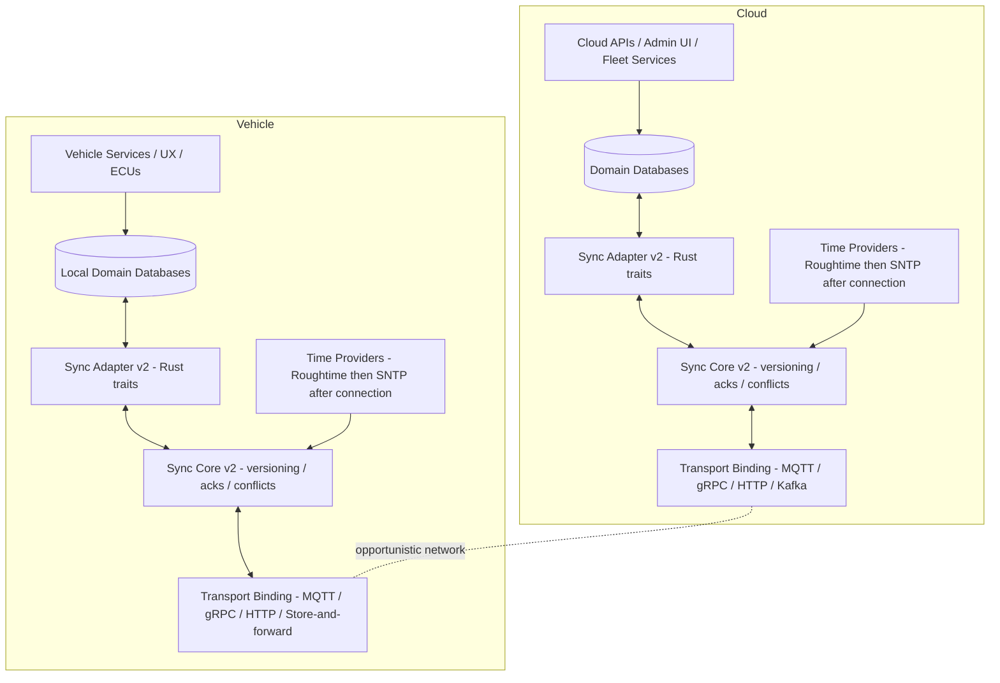
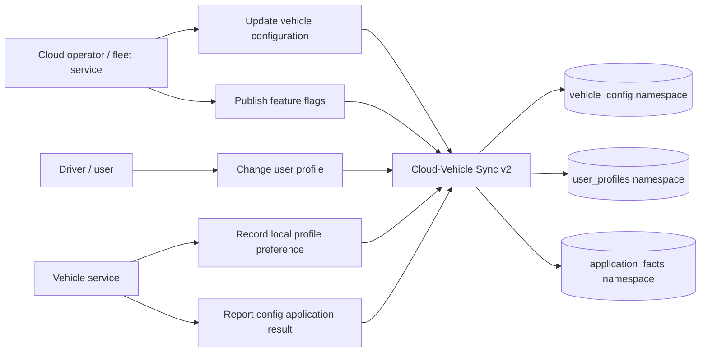
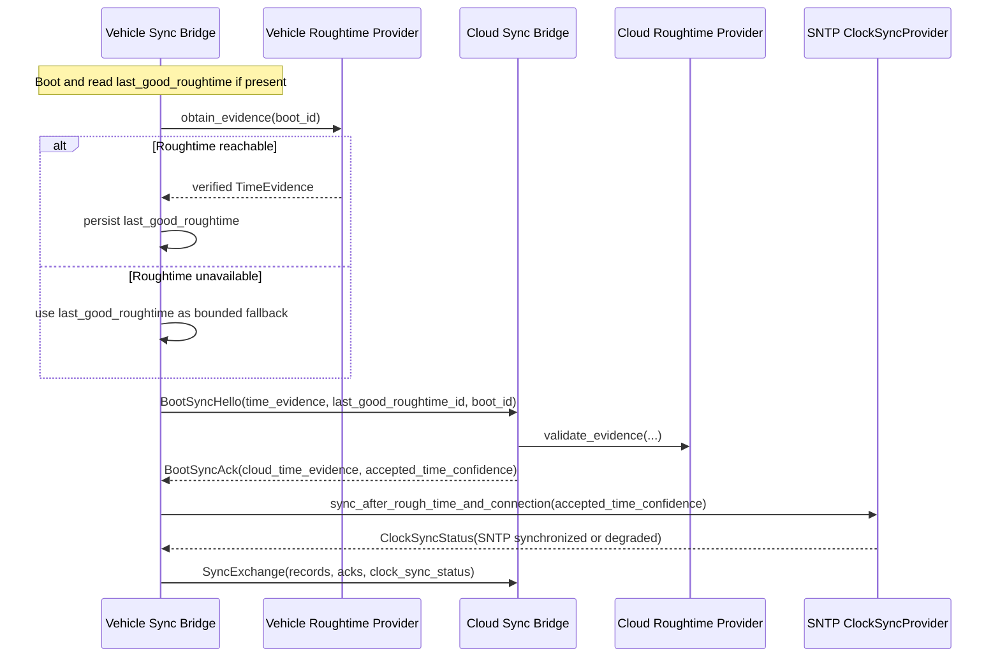
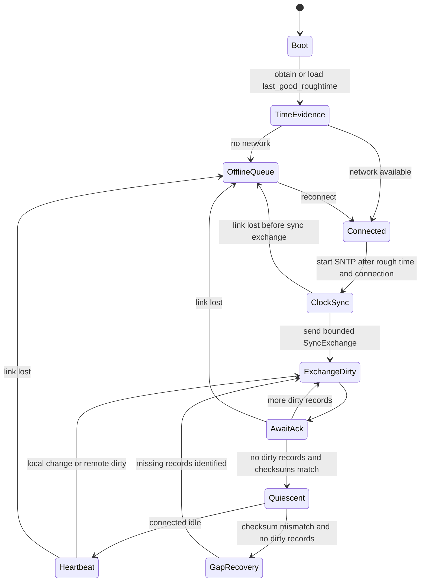
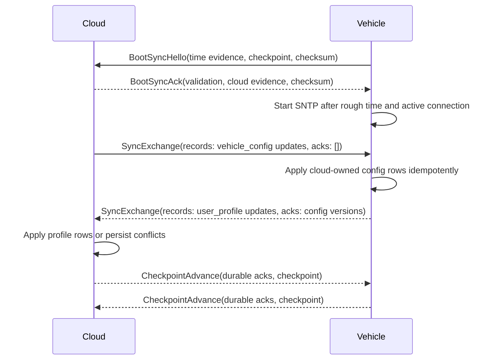
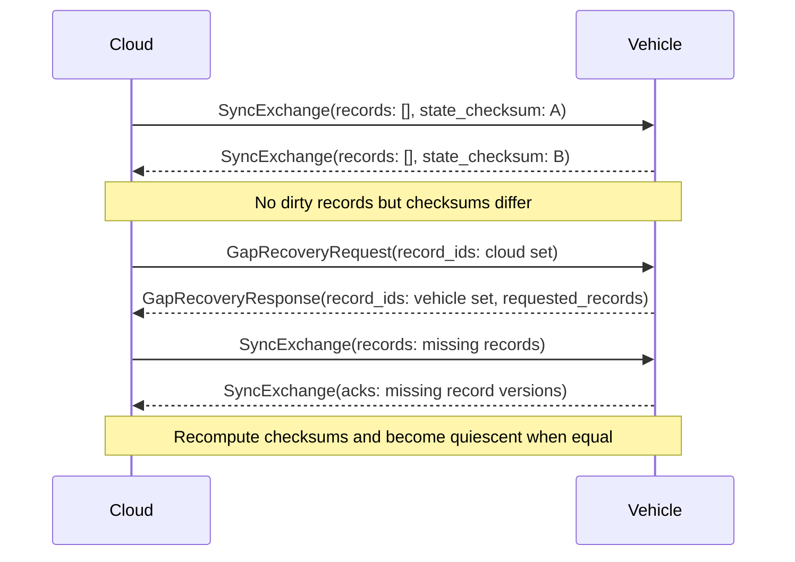
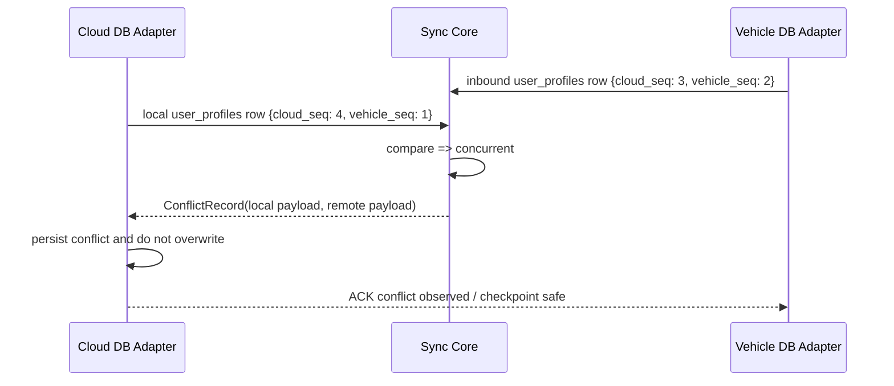

# Cloud-Vehicle Synchronization Protocol v2 Specification

**Version:** 2.0  
**Date:** 2026-06-08  
**Status:** DRAFT  
**Scope:** Documentation/specification only; implementation is expected to be Rust.

## 1. Purpose

Cloud-Vehicle Sync v2 generalizes the v1 bridge from scheduler/job mirroring into a reusable synchronization protocol for arbitrary database-backed namespaces such as vehicle configuration, user profiles, feature flags, scheduler data, and other domain tables.

The protocol is designed for opportunistic networks: connectivity may appear, disappear, and resume without warning. Correctness therefore comes from logical version vectors, idempotent replay, durable checkpoints, deterministic checksums, and explicit conflict surfacing. Wall-clock time is never the conflict winner.

v2 adds a boot-time time establishment model:

1. Use a replaceable `TimeEvidenceProvider` during initial sync after boot.
2. The initial provider is Roughtime, which supplies signed rough time evidence.
3. Persist `last_good_roughtime` so a rebooting peer does not start from zero when Roughtime is unavailable.
4. After rough time and an active network connection are established, use a replaceable `ClockSyncProvider`; the initial provider is SNTP.

Roughtime and SNTP are concrete provider choices, not hard-coded protocol dependencies. Future signed time sources or clock synchronization mechanisms can replace them without changing record versioning, adapter storage, or transport semantics.

## 2. Goals and Non-Goals

### 2.1 Goals

- Synchronize arbitrary database-backed namespaces between cloud and vehicle.
- Work over opportunistic connectivity with at-least-once delivery.
- Keep ordering and conflict decisions independent from wall-clock time.
- Provide boot-time signed time evidence and normal post-boot clock synchronization.
- Preserve enough time confidence for observability, audit, retention, and tombstone GC.
- Specify Rust traits and boundaries so future implementation can replace transport, storage, codecs, and time providers.
- Support bounded batches, durable ACKs, checkpoints, gap recovery, and deterministic quiescence detection.

### 2.2 Non-Goals

- Exactly-once delivery. v2 uses at-least-once delivery plus idempotency.
- Automatic conflict resolution for all domains. v2 surfaces conflicts; domain policy resolves them.
- Mandating a database engine, transport, payload format, Roughtime client library, or SNTP implementation.
- Vehicle-to-vehicle mesh synchronization.
- Requiring continuous network connectivity.

## 3. Architecture



### 3.1 Responsibility Split

| Responsibility | v2 Owner | Replaceable? |
| --- | --- | --- |
| Version vector comparison, ACK processing, conflict classification | Sync core | No, this is protocol behavior |
| Domain table mapping and payload encoding | `DomainCodec` / adapter | Yes |
| Durable records, ACKs, checkpoints, conflicts, tombstones | Storage adapter traits | Yes |
| Boot signed time evidence | `TimeEvidenceProvider` | Yes; Roughtime is initial provider |
| Normal clock synchronization after rough time and active connection | `ClockSyncProvider` | Yes; SNTP is initial provider |
| Network send/receive and buffering | `TransportBinding` | Yes |

## 4. Use Cases



Priority v2 namespaces:

| Namespace | Example table | Typical owner | Notes |
| --- | --- | --- | --- |
| `vehicle_config` | `vehicle_config(vehicle_id, key, value_json, schema_version)` | Cloud | Cloud-authored desired configuration. Vehicle may write application facts, not desired values. |
| `user_profiles` | `user_profiles(profile_id, display_name, preferences_json)` | Shared or owner-per-profile | Cloud app and vehicle UX can both change profile data; concurrent edits surface conflicts. |
| `feature_flags` | `feature_flags(vehicle_id, flag, enabled, rollout_id)` | Cloud | Cloud-owned reference data. |
| `application_facts` | `config_apply_results(vehicle_id, key, status, reason)` | Vehicle | Vehicle-owned operational facts. |

## 5. Core Data Model

### 5.1 Canonical Identity

Every synchronized row is represented as a canonical record:

```text
RecordLocator = {
  record_id: bytes,          // stable row key, e.g. table primary key encoded deterministically
  namespace_name: string,    // e.g. vehicle_config, user_profiles
  origin_node_id: string     // node that created the logical record
}
```

### 5.2 Version Vector

```text
VersionVector = {
  cloud_seq: u64,
  vehicle_seq: u64
}
```

Rules:

- Cloud increments `cloud_seq` only when cloud authors a new version.
- Vehicle increments `vehicle_seq` only when vehicle authors a new version.
- Version vectors, not time, determine equality, dominance, staleness, and concurrency.

Comparison:

| Compare result | Condition | Action |
| --- | --- | --- |
| Equal | all counters equal | duplicate if payload equal, conflict if payload differs |
| Remote dominates | remote >= local and at least one counter greater | apply remote |
| Local dominates | local >= remote and at least one counter greater | reject stale remote, ACK/replay-safe |
| Concurrent | neither dominates | persist conflict, do not silently overwrite |

### 5.3 Canonical Record

```text
CanonicalRecord = {
  locator: RecordLocator,
  version_vector: VersionVector,
  operation: CREATE | UPDATE | DELETE,
  payload: bytes,
  schema_version: u32,
  payload_checksum: u64,
  idempotency_key: string,
  correlation_id: string,

  // diagnostic/policy metadata only; never used for version ordering
  observed_time: TimeObservation,
  created_time_hint: Option<TimeObservation>,
  updated_time_hint: Option<TimeObservation>,
  tombstone_time_hint: Option<TimeObservation>,
  tombstone_reason: Option<string>
}
```

`TimeObservation` wraps provider-neutral time evidence. Roughtime and SNTP are expected initial providers, but record ordering does not depend on either.

## 6. Time Establishment Model

### 6.1 Provider-Neutral Interfaces

The protocol requires abstract capabilities, not hard-coded libraries:

```rust
trait TimeEvidenceProvider {
    fn provider_id(&self) -> ProviderId;        // e.g. "roughtime", "future-signed-time"
    fn obtain_evidence(&self, boot_id: BootId) -> Result<TimeEvidence>;
    fn validate_evidence(&self, evidence: &TimeEvidence) -> Result<TimeConfidence>;
}

trait ClockSyncProvider {
    fn provider_id(&self) -> ProviderId;        // e.g. "sntp", "ptp", "future-clock-sync"
    fn sync_after_rough_time_and_connection(&self, seed: &TimeConfidence) -> Result<ClockSyncStatus>;
    fn current_status(&self) -> ClockSyncStatus;
}
```

Initial v2 bindings:

- `TimeEvidenceProvider = Roughtime`
- `ClockSyncProvider = SNTP`

A deployment may replace either provider if it preserves the same abstract outputs: evidence, confidence interval, validation status, and persisted last-good state.

### 6.2 Time Evidence Fields

```text
TimeEvidence = {
  provider_id: string,
  boot_id: string,
  evidence_id: string,
  midpoint_unix_ms: u64,
  radius_ms: u32,
  signed_evidence: bytes,
  public_key_id: string,
  verified: bool,
  received_monotonic_ms: u64
}

TimeConfidence = {
  provider_id: string,
  earliest_unix_ms: u64,
  latest_unix_ms: u64,
  confidence: VERIFIED | LAST_KNOWN_GOOD | UNVERIFIED | UNAVAILABLE,
  source_evidence_id: string
}

ClockSyncStatus = {
  provider_id: string,
  synchronized: bool,
  offset_ms: i64,
  stratum_or_quality: string,
  last_sync_unix_ms: u64,
  seeded_by_evidence_id: string
}
```

### 6.3 Boot-Time Flow



Rules:

1. A peer SHOULD attempt Roughtime immediately after boot and before normal sync batches.
2. A peer MUST persist the latest verified Roughtime evidence as `last_good_roughtime`.
3. If Roughtime is unavailable, a peer MAY use `last_good_roughtime` as degraded time confidence and continue logical sync.
4. After rough time and an active network connection are established, the peer SHOULD start SNTP clock synchronization.
5. If there is no active connection or SNTP is unavailable, logical sync MAY continue with degraded clock status.
6. Neither Roughtime nor SNTP can select conflict winners.

## 7. Wire Messages

v2 keeps the v1 message families and adds boot/time metadata. A later Rust implementation may encode these via protobuf, CBOR, FlatBuffers, or another schema, but the semantic messages are:

```text
CloudVehicleSyncEnvelopeV2 = oneof {
  BootSyncHello,
  BootSyncAck,
  SyncExchange,
  CheckpointAdvance,
  GapRecoveryRequest,
  GapRecoveryResponse
}
```

### 7.1 BootSyncHello

```text
BootSyncHello = {
  sender_node_id,
  recipient_node_id,
  boot_id,
  supported_protocol_versions,
  supported_time_evidence_providers,
  supported_clock_sync_providers,
  time_evidence: Option<TimeEvidence>,
  last_good_roughtime: Option<TimeEvidence>,
  last_checkpoint: Option<CheckpointToken>,
  state_checksum,
  correlation_id,
  idempotency_key
}
```

### 7.2 BootSyncAck

```text
BootSyncAck = {
  sender_node_id,
  recipient_node_id,
  accepted_protocol_version,
  accepted_time_evidence_provider,
  accepted_clock_sync_provider,
  time_evidence_validation: TimeConfidence,
  responder_time_evidence: Option<TimeEvidence>,
  checkpoint_hint: Option<CheckpointToken>,
  state_checksum,
  correlation_id,
  idempotency_key
}
```

### 7.3 SyncExchange

```text
SyncExchange = {
  sender_node_id,
  recipient_node_id,
  records: [CanonicalRecord],
  acked_records: [VersionAck],
  state_checksum,
  checkpoint: Option<CheckpointToken>,
  time_confidence: Option<TimeConfidence>,
  clock_sync_status: Option<ClockSyncStatus>,
  correlation_id,
  idempotency_key
}
```

### 7.4 CheckpointAdvance and Gap Recovery

`CheckpointAdvance`, `GapRecoveryRequest`, and `GapRecoveryResponse` preserve v1 semantics. v2 adds optional `time_confidence` and `clock_sync_status` fields for diagnostics and retention policy, not ordering.

## 8. Opportunistic Connectivity Behavior



Requirements:

- Local mutations MUST be durably recorded even while offline.
- Dirty enumeration MUST be independent of network state.
- On reconnect, peers MUST replay dirty records and unpersisted ACKs idempotently.
- SNTP or another `ClockSyncProvider` MUST only be started and used after an active network connection is established.
- Batches SHOULD be bounded by record count and byte size.
- A sender MAY send heartbeat-only `SyncExchange` messages while connected.
- A peer MUST NOT assume that a missing ACK means the remote did not apply the record.
- A peer MUST use idempotency keys and version comparison on every replay.

## 9. Communication Diagrams

### 9.1 Normal Reconnect and Dirty Exchange



### 9.2 Gap Recovery After Clean Checksum Mismatch



### 9.3 Conflict Surfacing



## 10. Quiescence and Checksums

A namespace is quiescent for a session when:

```text
for every included record:
  local version == remote acknowledged version
and no dirty records remain
and state_checksum(local logical state) == state_checksum(remote logical state)
and no required boot/time handshake is pending for the current boot_id
```

Checksum input MUST include:

- record identity
- namespace
- origin node
- version vector
- operation
- payload
- schema version
- tombstone state

Checksum input MUST exclude:

- Roughtime evidence bytes
- SNTP status
- wall-clock diagnostic timestamps
- idempotency ledger contents
- checkpoint values
- conflict records
- transport metadata

## 11. Security and Validation

- `sender_node_id` MUST match authenticated transport identity.
- Time evidence signatures MUST be validated by the selected `TimeEvidenceProvider`.
- Roughtime public keys and provider identities MUST be configured or provisioned securely.
- `last_good_roughtime` MUST be stored with provenance and validation status.
- SNTP MUST NOT be started or used before both rough time and an active network connection exist unless deployment policy explicitly permits degraded time.
- Payload integrity SHOULD use payload checksums plus transport security; checksums are not a substitute for authentication.
- Ownership rules MUST be enforced per namespace or per record class.

## 12. Implementation Mapping for Rust

Expected crates/modules:

```text
sync-types          // CanonicalRecord, VersionVector, TimeEvidence, ClockSyncStatus
sync-core           // compare/apply/ack/checkpoint/gap decisions
sync-adapter        // Rust traits for storage, codecs, time, transport
sync-transport-*    // MQTT/gRPC/HTTP/Kafka bindings
sync-time-*         // Roughtime provider, SNTP provider, future providers
sync-adapter-sql    // SQL database adapter implementations
```

The protocol core should depend on traits and value types, not concrete databases, Roughtime libraries, SNTP libraries, or transports.

## 13. v1 to v2 Changes

| Area | v1 | v2 |
| --- | --- | --- |
| Primary use case | Generic record sync, scheduler-oriented examples | Arbitrary database table sync, vehicle config, user profiles |
| Implementation direction | Existing C++ reference implementation | Future Rust implementation |
| Adapter interface | `CloudVehicleDbAdapter` | Replacement Rust trait set |
| Time handling | Wall-clock diagnostic only | Provider-neutral time evidence; Roughtime at boot, SNTP after rough time and active connection |
| Technology coupling | Transport/storage-neutral | Also time-provider and codec-neutral |
| Diagrams | Limited | Architecture, use case, communication, state, recovery |

## 14. References

- `reference-specs/protocols/cloud-vehicle-sync-protocol-v1.md`
- `reference-specs/protocols/cloud-vehicle-db-adapter-spec-v2.md`
- `reference-specs/protocols/cloud-vehicle-database-sync-adapter-example-v2.md`
- Roughtime: signed rough time evidence for boot-time freshness
- SNTP: normal network time synchronization after rough time and active connectivity are available
